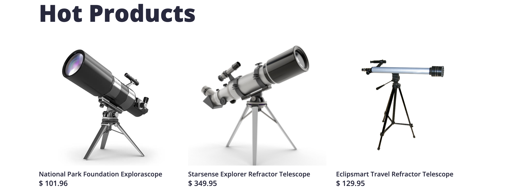

# E-Commerce Microservices Project

## Overview
This project is an **e-commerce platform** built with a **microservices architecture**. It consists of **22 microservices**, out of which I worked on the following three services:  
- **Recommendation Service** (Python)  
- **Ad Service** (Java with Gradle)  
- **Product Catalog Service** (Golang)  

I containerized these services using **Docker**, orchestrated them with **Kubernetes (EKS)**, and implemented **CI/CD with GitHub Actions**.

## Project Structure
```
microservices-automation/
│── src/      
│    │── recommendation/       
│    │   ├── Dockerfile                                    
│    │   ├── requirements.txt          
│    │   ├── recommendation_server.py                                      
│    │── ad/                   
│    │   ├── Dockerfile                
│    │   ├── src/                      
│    │   ├── build.gradle                               
│    │── product-catalog/      
│    │   ├── Dockerfile                
│    │   ├── main.go                   
│    │   ├── go.mod                    
│── kubernetes/                          
│   ├── recommendation/
│   │   ├── deploy.yml             
│   │   ├── service.yml
│   ├── ad/
│   │   ├── deploy.yml
│   │   ├── service.yml
│   ├── product-catalog/
│   │   ├── deploy.yml
│   │   ├── service.yml
│── .github/workflows/            
│   ├── ci.yml                    
│── images/                
│── docker-compose.yml
│── README.md                     
```

## Architecture Diagram


## Microservices Details

### Recommendation Service (Python)
- Built using **dotenv**
- Uses **Docker** for containerization
- API exposed via **Kubernetes Service**
- CI/CD via **GitHub Actions**


### Ad Service (Java with Gradle)
- Built using **Spring Boot**
- Dependency management with **Gradle**
- Packaged as a Docker container
- Deployed using Kubernetes on **EKS**


### Product Catalog Service (Golang)
- Built using **Go**
- Lightweight and fast API responses
- Kubernetes manages scalability

## Deployment Flow
1. **Build & Test**  
   - Each microservice is built & tested via **GitHub Actions**  
   - Docker images are pushed to **Docker Hub**  
2. **Containerization**  
   - Three services are dockerized  
   - `docker-compose.yml` helps in local testing  
3. **Orchestration (Kubernetes - EKS)**  
   - Deployed using Kubernetes deployment & service YAML files  
   - Services are exposed via Kubernetes Load Balancer  

## Running Locally
1. Clone the repository:  
   ```sh
   git clone https://github.com/yourusername/ecommerce-microservices.git
   cd ecommerce-microservices
